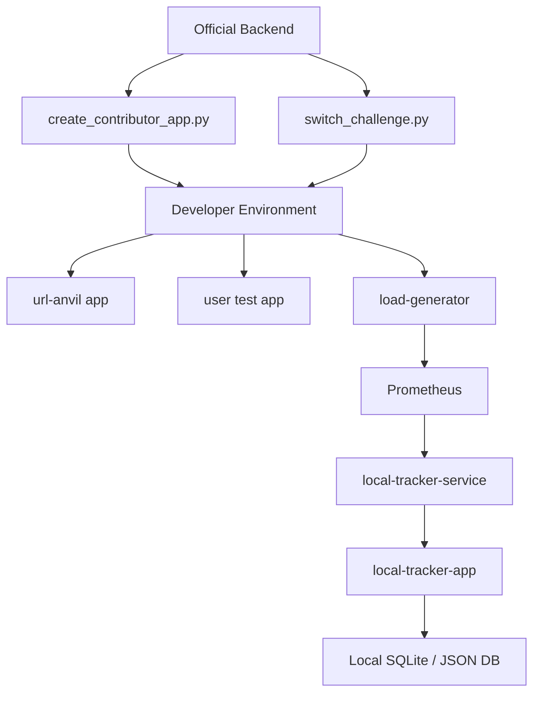

# SRE Chaos Challenge: A Competitive SRE Platform

> **Status:** 🟢 Local sandbox stable | ⚙️ Automation Phase (Epoch 2) in progress  
> **Focus:** Improving test automation, onboarding UX, and CI/CD workflows  
> **Next milestone:** Cloud-ready environment management (Epoch 3)

**Table of Contents**

*   [Project Vision](#project-vision)
*   [System Flow Overview](#system-flow-overview)
*   [Project Roadmap](#project-roadmap)
*   [Prerequisites](#prerequisites)
*   [How to Compete](#how-to-compete)
*   [Advanced Documentation](#advanced-documentation)
*   [Understanding the Challenges](#understanding-the-challenges)
*   [Legal & Policies](#legal--policies)
*   [License](#license)

---

## Project Summary

This project is a containerized platform designed to teach and evaluate Site Reliability Engineering (SRE) concepts through hands-on challenges, with a strong emphasis on building resilient systems that can handle stress and gracefully degrade. Contributors deploy their own web applications, which are monitored in real-time by the platform's internal Prometheus stack. The platform emphasizes **verifiable, live metrics** rather than self-reported results, ensuring scoring integrity.

---

## System Flow Overview



---

## Project Roadmap

This project is developed in major "Epochs". We have recently completed **Epoch 1 (Documentation & Knowledge Base Consolidation)**.

We are now beginning **Epoch 2 (Platform Maturation & Automation)**.

For a detailed breakdown of the current development phase and future plans, please see our official roadmap:
*   **[PROJECT_ROADMAP.md](./PROJECT_ROADMAP.md)**

---

## Hacktoberfest 2025 Status: Local Development Focus

**Important Notice for Hacktoberfest Participants and Contributors:**

We are actively preparing this project for Hacktoberfest 2025! Our current development focus is on solidifying the **local Docker Compose experience**. This means we are prioritizing a smooth and clear local development environment for contributors.

**Key Points for Local Development:**

*   **Seamless Onboarding:** The `create_contributor_app.py` script now automates the setup of your contributor application and updates your `.env` file for a smooth start.
*   **One App Per User:** For local development, please focus on running **one contributor application at a time**. This ensures a clear understanding of your application's performance and avoids conflicts with other example applications.
*   **Clean Slate:** We recommend starting with a clean Docker environment to prevent unintended interactions between services. Instructions below will guide you on how to achieve this.
*   **Real-time Monitoring:** The core goal is to provide a live, real-time monitoring environment where you can see the impact of your application changes immediately in Prometheus and Grafana.

We appreciate your patience and contributions as we refine this platform!

---

## Prerequisites

*   [Docker](https://docs.docker.com/get-docker/)
*   [Docker Compose](https://docs.docker.com/compose/install/)
*   [Python](https://www.python.org/downloads/)

## Python Virtual Environment (venv)

It is highly recommended to use a Python virtual environment (`venv`) for managing project dependencies. This isolates project-specific libraries from your global Python installation, preventing conflicts and ensuring consistent environments.

### Setup Instructions:

1.  **Create a virtual environment** (from the project root):
    ```bash
    python -m venv venv
    ```
2.  **Activate the virtual environment**:
    *   **On Windows (Command Prompt/PowerShell):**
        ```bash
        .\venv\Scripts\activate
        ```
    *   **On macOS/Linux (Bash/Zsh):**
        ```bash
        source venv/bin/activate
        ```

    You should see `(venv)` prepended to your terminal prompt, indicating the virtual environment is active.

3.  **Install dependencies**:
    Once activated, you can install project-specific dependencies using `pip`.

    ```bash
    pip install -r requirements.txt
    ```

Remember to activate your virtual environment whenever you start a new terminal session to work on the project.

## How to Compete

Follow these steps to get your own application monitored by the platform and compete on the leaderboard.

### Step 1: Configure Your Environment

Before launching, you need to create your local environment configuration file.

```bash
# Copy the example file to create your own .env file
# On Windows:
copy .env.example .env
# On macOS/Linux:
cp .env.example .env
```

This file contains the default passwords for the local database. You can leave them as they are for local development.

### Step 2: Start the Platform

Next, get the core services of the challenge running. This includes the backend, database, frontend leaderboard, and the monitoring stack (Prometheus, Grafana).

**For a clean start (recommended):**
```bash
docker-compose down --remove-orphans
```

```bash
# Build and run all services in the background
docker-compose up --build -d
```

### Step 3: Onboard Your Application

Now, run the onboarding script. This will create a dedicated application directory for you. Ensure your Python virtual environment is active (see "Python Virtual Environment (venv)" under "Prerequisites").

```bash
python create_contributor_app.py
```

The script will prompt you for a GitHub username. This will be your display name on the leaderboard. It will then create your personal application directory at `contributors/<your-username>/`.

Your goal is to modify the files in this directory (`index.html`, `nginx.conf`, `Dockerfile`) to create a web service that can best handle the challenges.

### Step 4: Run Your Application

The onboarding script will provide you with a command to run your new application. It will look like this:

```bash
docker-compose -f docker-compose.yml -f compose-files/docker-compose.<your-username>.yml up --build -d
```

Running this command starts your application and its metric exporter. The platform's Prometheus will automatically discover your running application and begin scraping its performance metrics in real-time.

### Step 5: Switch Your Active Challenge

You can choose which challenge you are competing in at any time without stopping your application. Use the `switch_challenge.py` script:

```bash
# Example: Switch to the 'longest-upkeep' challenge
python switch_challenge.py --user <your-username> --challenge longest-upkeep
```

The available challenges are `robust-service`, `graceful-degradation`, and `longest-upkeep`. The backend will immediately start applying the scoring rules for the new challenge to the metrics it receives from your application.

### Step 6: View the Leaderboard

Open your browser and navigate to the leaderboard to see your ranking!

*   **Leaderboard**: `http://localhost:8081`

Use the buttons at the top of the page to switch between the different challenge leaderboards.

### Step 7: View Local Tracking

Open your browser and navigate to the local tracker to see the results of your load tests!

*   **Local Tracker**: `http://localhost:8082`

Use the tabs at the top of the page to switch between the different targets.

## Understanding the Challenges

The SRE Chaos Challenge features three distinct challenges, each designed to test different aspects of your application's performance and resilience, with a focus on building systems that can gracefully handle stress. For detailed rules, strategies, and the philosophy behind each challenge, see the [Contributor Guide (docs/CONTRIBUTOR_GUIDE.md)](./docs/CONTRIBUTOR_GUIDE.md).

## Advanced Documentation

For a detailed breakdown of the project's architecture, components, and strategic decisions, please see the documentation in the `docs` directory.

*   **[Git Tutorial (docs/GIT_TUTORIAL.md)](./docs/GIT_TUTORIAL.md)**: A guide to Git basics, forking workflow, and project navigation.
*   **[Contributor Guide (docs/CONTRIBUTOR_GUIDE.md)](./docs/CONTRIBUTOR_GUIDE.md)**: A comprehensive guide for new contributors.
*   **[Tech Stack Overview (docs/TECH_STACK.md)](./docs/TECH_STACK.md)**: A detailed breakdown of each service and how they interconnect.
*   **[Full Command Glossary (docs/COMMAND_GLOSSARY.md)](./docs/COMMAND_GLOSSARY.md)**: A reference for all Docker and project-specific commands.
*   **[Script Reference (docs/SCRIPT_REFERENCE.md)](./docs/SCRIPT_REFERENCE.md)**: A reference for all the scripts in the `scripts` directory.
*   **[Load Testing Guide (docs/LOAD_TESTING_GUIDE.md)](./docs/LOAD_TESTING_GUIDE.md)**: A guide on how to run load tests against your applications.
*   **[Rules of Engagement (docs/RULES_OF_ENGAGEMENT.md)](./docs/RULES_OF_ENGAGEMENT.md)**: Guidelines for fair play and contributor conduct.

## Legal & Policies

*   **[Privacy Policy (docs/legal/PRIVACY_POLICY.md)](./docs/legal/PRIVACY_POLICY.md)**
*   **[Terms of Service (docs/legal/TERMS_OF_SERVICE.md)](./docs/legal/TERMS_OF_SERVICE.md)**
*   **[Code of Conduct (docs/legal/CODE_OF_CONDUCT.md)](./docs/legal/CODE_OF_CONDUCT.md)**

## License

*   **[MIT License](./LICENSE)**
